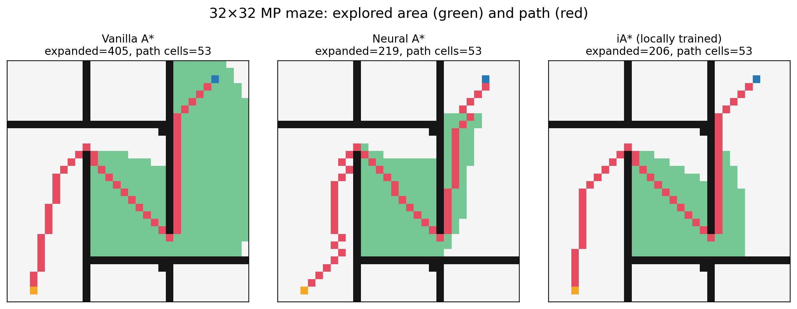

# iA* final reproduction report

**Status:** completed on 2026-09-21; archived as a partial reproduction.

## Scope

This study evaluates whether the released iA* implementation can reduce A*
search effort on the official 32x32 MP maze dataset while preserving path
quality. It compares Vanilla A*, the released Neural A* baseline, and locally
trained iA* models.

Three independent iA* models were trained with seeds `1234`, `2026`, and
`3407`. Each model used all 800 training maps for 20 epochs with batch size 100.
Every checkpoint was evaluated on the same 100 test maps and the same sampled
starts (`eval_seed=2026`).

Environment: Windows, Python 3.10.21, PyTorch 2.14.0 CPU, NumPy 1.26.4. Runtime
includes neural encoder inference. Each planner received three warm-up calls;
each case was timed five times, and planner order rotated by case.

## Results

Values are mean ± sample standard deviation across three runs. Runtime columns
first aggregate each run using the median or P95 across its 100 cases.

| Method | Success | Path length | Expanded nodes | Median runtime (ms) | P95 runtime (ms) |
| --- | ---: | ---: | ---: | ---: | ---: |
| Vanilla A* | 100.0 ± 0.0% | 34.084 ± 0.000 | 70.99 ± 0.00 | 8.568 ± 0.247 | 75.692 ± 1.748 |
| Neural A* | 100.0 ± 0.0% | 37.267 ± 0.000 | 60.76 ± 0.00 | 12.232 ± 0.414 | 56.012 ± 0.301 |
| iA* (20 epochs) | 100.0 ± 0.0% | 34.391 ± 0.062 | 55.78 ± 1.25 | 19.269 ± 0.386 | 66.334 ± 4.187 |

Paired relative changes versus Vanilla A*:

| Method | Path length | Expanded nodes | Median runtime |
| --- | ---: | ---: | ---: |
| Neural A* | +9.34% | -14.41% | +42.77% |
| iA* | +0.90% (95% CI +0.73 to +1.09%) | -21.43% (95% CI -23.27 to -19.75%) | +124.93% (95% CI +123.33 to +127.99%) |

The final iA* runs by seed expanded 54.47, 56.97, and 55.90 nodes on average.
All three retained 100% success. The search-efficiency improvement is therefore
consistent across these seeds, but it does not translate into a CPU runtime
improvement in this matrix-based differentiable implementation.



## Reproduce

```powershell
conda activate iastar-repro
python reproduction\run_multiseed_32.py `
  --epochs 20 `
  --seeds 1234 2026 3407 `
  --train-samples 800 `
  --batch-size 100 `
  --eval-samples 100 `
  --eval-seed 2026 `
  --warmup 3 `
  --timing-repeats 5
```

Key artifacts:

- `results/week2/metrics_all.csv`: all 900 per-case method records;
- `results/week2/runs_by_method.csv`: nine run-level method summaries;
- `results/week2/summary_by_method.csv`: mean, standard deviation, and 95%
  bootstrap interval across runs;
- `results/week2/paired_vs_astar.csv`: paired relative changes versus A*;
- `results/week2/search_comparison_seed_3407.png`: final qualitative example.

Model checkpoints are intentionally excluded from Git and can be regenerated
with the command above.

## Limitations

- The official iA* checkpoint is still unloadable; upstream Issue #2 remains
  open with the same archive error. This study uses locally trained models.
- Training covers 20 epochs, not the paper-scale 200 epochs.
- Evaluation covers one 32x32 MP family, not the paper's complete set of map
  families, resolutions, generalization tests, and ablations.
- Three training seeds provide a stability check but only a coarse uncertainty
  estimate; bootstrap intervals are descriptive.
- The repository's implemented self-supervised L1 history-to-own-path loss is
  related to, but not algebraically identical to, the full objective written in
  the paper.
- Runtime is hardware- and implementation-dependent and was measured on CPU.

## Final conclusion

The reproduction supports the narrow claim that locally trained iA* models can
consistently reduce node expansions on this 32x32 benchmark while adding less
than 1% mean path length. It does not support a runtime-speedup claim on CPU and
does not constitute a full reproduction of the published paper. The code,
protocol, raw results, statistical summaries, and limitations are now recorded;
the project is closed with no further iA* work planned.
